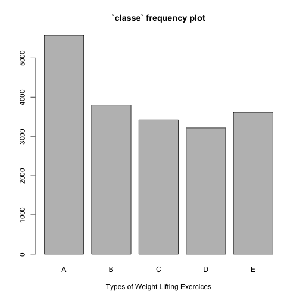

##Synopsis

Using devices such as Jawbone Up, Nike FuelBand, and Fitbit it is now possible to collect a large amount of data about personal activity relatively inexpensively. One thing that people regularly do is quantify how much of a particular activity they do, but they rarely quantify how well they do it.

In this project, the data were collected from accelerometers on the belt, forearm, arm, and dumbell of 6 participants. They were asked to perform barbell lifts correctly and incorrectly in 5 different ways: exactly according to the specification (Class A), throwing the elbows to the front (Class B), lifting the dumbbell only halfway (Class C), lowering the dumbbell only halfway (Class D) and throwing the hips to the front (Class E). Class A corresponds to the specified execution of the exercise, while the other 4 classes correspond to common mistakes.

More information is available from the website here: http://groupware.les.inf.puc-rio.br/har (see the section on the Weight Lifting Exercise Dataset).

The goal of this project is to predict the manner in which the participants did the exercise. In this study, we build a prediction model using different features and apply the model to predict 20 different test cases provided.

##Methodology
First, the data was preprocessed to find the relevant variables and format the data so that a classifier could be run on it.

The following steps are taken: 1. Clean the training set. 2. Split it into training/validation sets. 3. Build a model on the training set. 4. Evaluate the model. 5. Apply the model on provided test cases.

**Data Preprocessing**

The training data for this project are available here: 
https://d396qusza40orc.cloudfront.net/predmachlearn/pml-training.csv

The test data are available here: 
https://d396qusza40orc.cloudfront.net/predmachlearn/pml-testing.csv

Read data from file

```r
# read training set
df <- read.csv("pml-training.csv", na.strings=c("NA",""))
```

The original dataset has 160 variables including the “classe” class variable that indicates the manner of the exercise activity. To reduce dimensionality, only the most useful predictors (i.e., variables) were selected. This was accomplished by eliminating variables that had NAs, non-numeric variables, variables that had too few unique values.


```r
library(caret)
```

```
## Loading required package: lattice
## Loading required package: ggplot2
```

```r
# define a function data frame preprocessing
preproc_df <- function(df){
    # Removal of NAs
    clean_df <- df[, which(as.numeric(colSums(is.na(df)))==0)]
    # Removal of Non-numeric Variables
    clean_df <- clean_df[,-(1:7)]
    # Removal of Near-Zero Values
    end <- ncol(clean_df)
    #clean_df[,-end] <- data.frame(sapply(clean_df[,-end], as.numeric))
    nzv <- nearZeroVar(clean_df[, -end], saveMetrics=TRUE)
    clean_df <- clean_df[,!as.logical(nzv$nzv)]
    return(clean_df)
}

clean_df <-preproc_df(df)

# look at number of columns of clean data set
dim(clean_df)
```

```
## [1] 19622    53
```

Look at some summary statistics and frequency plot for the “classe” variable.


```r
summary(clean_df$classe)
```

```
##    A    B    C    D    E 
## 5580 3797 3422 3216 3607
```

```r
plot(clean_df$classe,main = "`classe` frequency plot", xlab = "Types of Weight Lifting Exercices")
```

 


**Model Building**

First split the training data into training and validation sets.


```r
set.seed(19)
inTrain <- createDataPartition(df$classe, p=0.6, list = FALSE)
train <- clean_df[inTrain,]
subtest <- clean_df[-inTrain,]
```


Using the features in the training set, we  build our model using the Random Forest. The 2-fold cross validation is used.


```r
ctrl <- trainControl(allowParallel = TRUE, method = "cv", number = 2);
model <- train(classe ~., data = train, method = "rf", trControl=ctrl, importance=TRUE)
```

```
## 1 package is needed for this model and is not installed. (randomForest). Would you like to try to install it now?
## 1: yes
## 2: no
## 
## 
## The downloaded binary packages are in
## 	/var/folders/7j/zccg_dhs78l68_zhh0hd9jjh0000gn/T//RtmphbSsZp/downloaded_packages
```

```
## Loading required package: randomForest
## randomForest 4.6-10
## Type rfNews() to see new features/changes/bug fixes.
```

```
## Error in loadNamespace(name): there is no package called 'e1071'
```

```r
model$finalModel
```

```
## Error in eval(expr, envir, enclos): object 'model' not found
```
The estimate out of sample error is about 0.73%.

**Cross-Validation and Model Evaluation**

Calculate the “out of sample” accuracy which is the prediction accuracy of our model on the validation set.


```r
subtest_pred <- predict(model, subtest)
```

```
## Error in predict(model, subtest): object 'model' not found
```

```r
subtest_error <- confusionMatrix(subtest_pred, subtest$classe)
```

```
## Error in confusionMatrix(subtest_pred, subtest$classe): object 'subtest_pred' not found
```

```r
subtest_error
```

```
## Error in eval(expr, envir, enclos): object 'subtest_error' not found
```

From the above result,  the out of sample accuracy value is 99.34%. Therefore the out of sample error is 1- 99.34% = 0.66%.

```r
ose <- 1 - subtest_error$overall[1];
```

```
## Error in eval(expr, envir, enclos): object 'subtest_error' not found
```

```r
names(ose) <- "Out of Sample Error"
```

```
## Error in names(ose) <- "Out of Sample Error": object 'ose' not found
```

```r
ose
```

```
## Error in eval(expr, envir, enclos): object 'ose' not found
```
The out of sample error is similar as the expected value.

**Prediction Assignment**

In this section, we apply our model to each of the 20 test cases in the testing data set provided.


```r
test <- read.csv("pml-testing.csv")
# clean test data
clean_test <- preproc_df(test)
# look at number of columns of clean test set
dim(clean_test)
```

```
## [1] 20 53
```

```r
# predict
answers <- predict(model, clean_test)
```

```
## Error in predict(model, clean_test): object 'model' not found
```

```r
answers <- as.character(answers)
```

```
## Error in eval(expr, envir, enclos): object 'answers' not found
```

```r
answers
```

```
## Error in eval(expr, envir, enclos): object 'answers' not found
```

Finally, we write the answers to files as specified by the course instructor using the following code segment.

```r
pml_write_files = function(x) {
    n = length(x)
    for (i in 1:n) {
        filename = paste0("problem_id_", i, ".txt")
        write.table(x[i], file = filename, quote = FALSE, row.names = FALSE, 
            col.names = FALSE)
    }
}

pml_write_files(answers)
```

```
## Error in pml_write_files(answers): object 'answers' not found
```

##Conclusions

For this project, we chose Random Forest to build our model to predict the manner of exercies acitivities based on the data collected from accelerometers on the belt, forearm, arm, and dumbell of 6 participants. Random Forest builds a highly accurate classifier, which balances bias and variance trade-offs by settling for a balanced model.

We obtained a really good accuracy based on the model we developed above.

